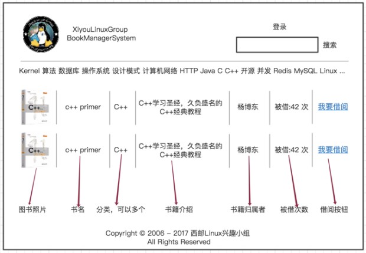

# 一：项目背景

小组目前的书籍管理存在以下问题：
- 没有分类，不易查询。
- 没有online。
- 新书较少，且范围有限。
- 没有资源最大化，即书籍资源没有做到小组范围共享。

此项目旨在开发一套图书管理系统，能帮助大家查询小组的书籍，也能做到书籍资源最大化利用。

# 二：功能需求

## 1：浏览功能
即用户未登录时可以正常浏览和搜索相应的书籍，查看图书评论等。
## 2：登录功能
用户信息默认和小组CS平台信息一致，为小组内部成员，登录时通过小组OAuth验证即可，具体联系（@13级王博 @14级朱新全）。

备用：如果OAuth验证无法完成，暂时可将CS平台上用户数据拉一份作为此项目单独的数据库。密码加密保存在数据库中。

## 3：查询功能
查询维度:
- 书名（eg:Linux服务端编程）
- 作者名（eg:陈硕）
- 归属者名（eg:杨博东）

备注：
- 也可通过分类查询（通过点击分类标签列出相关的书籍，eg:C++）

## 4：书籍管理功能

### （1）：上传书籍
允许小组成员登录之后将自己的书籍信息上传至此平台，上传的选项包括（*为必选项）：
- 书籍照片
- *书籍名
- *书籍分类（列出标签，勾选即可）
- *作者姓名
- *归属者姓名（默认自动填写为当前用户）
- 书籍描述

备注：此平台面向小组所有成员，因此已经工作的学长也可以通过此平台向小组捐书。

### （2）：维护书籍
用户可进入"我的书籍"界面，维护自己的书籍：
- 更改信息（重新上传图书照片，更改作者信息，添加描述等）
- 下线书籍（书籍损坏或者其他原因暂时不能借出）
- 删除书籍（因毕业离校或者其他原因此书籍永远不再借出）

## 5：借书功能
在每一条书籍信息的后面，提供"借阅"按钮，点击之后跳转到此书籍的"详细信息"界面，可以看到此书籍的"生命线"（即借阅路线），然后点击生命线最后的"+"号，确认借阅信息即可借阅成功。

## 6：评论功能
在正常浏览时，点击"书名"跳转至此书籍的"详细信息"界面，包括评论，用户可以添加书籍评论或者读书笔记。

## 7：动态日志实时展示功能
在首页提供版块，将各种操作日志动态滚动展示。  
eg: `20:33:33 A从B借阅书籍《Linux服务端编程》`

# 三：设计方案

## 1：项目形式
- 类型：Web
- 语言：JSP + Servlet
- 数据库：MySQL
- Maven

## 2：页面设计

### 1：首页（未登录）：
顶部标签：左：logo 右：登录标签  
搜索框  
分类标志栏：参考segmentfalut  
主体：每条书籍的信息（图片：书籍名：分类：书籍描述：归属者：被借次数：借阅按钮）、默认显示最新的十条。

eg:见下图,时间关系只画了这一张图。
  

### 2：首页（登录后）：
顶部标签：左：logo 右：退出登录、我的书籍、上传书籍  
搜索框  
分类标志栏：参考segmentfalut  
主体：每条书籍的信息（图片：书籍名：分类：书籍描述：归属者：被借次数：借阅按钮）、默认显示最新的十条。

### 5：上传书籍页面
顶部标签：左：logo 右：退出登录、我的书籍、上传书籍  
主体（*为必填）：  
- 书籍照片
- *书籍名
- *书籍分类（列出标签，勾选即可）
- *作者姓名
- *归属者姓名（默认自动填写为当前用户）
- 书籍描述  

按钮：确认 | 取消

### 4：我的书籍页面
顶部标签：左：logo 右：退出登录、我的书籍、上传书籍  
搜索框  
主体：每条书籍的信息（图片：书籍名：分类：书籍描述：归属者：被借次数：**更改信息：下线书籍：删除书籍**）、默认显示个人书籍最新的十条。

### 5：书籍详细信息页面
顶部标签：左：logo 右：退出登录、我的书籍、上传书籍  
搜索框  
主体：每条书籍的信息（图片：书籍名：分类：书籍描述：归属者：被借次数）  
书籍生命线：显示书籍被借阅的过程、最后提供"+"按钮，提供借书功能 
书籍评论：列出此书籍的所有评论。

## 3：数据库设计
[https://github.com/yangbodong22011/bookSystem/blob/master/src/main/resources/bookSystem.sql](https://github.com/yangbodong22011/bookSystem/blob/master/src/main/resources/bookSystem.sql)
[https://github.com/yangbodong22011/bookSystem/blob/master/src/main/resources/bookInsert.sql](https://github.com/yangbodong22011/bookSystem/blob/master/src/main/resources/bookInsert.sql)
# 四：编码 & 测试
# 五：上线
# 六：维护
